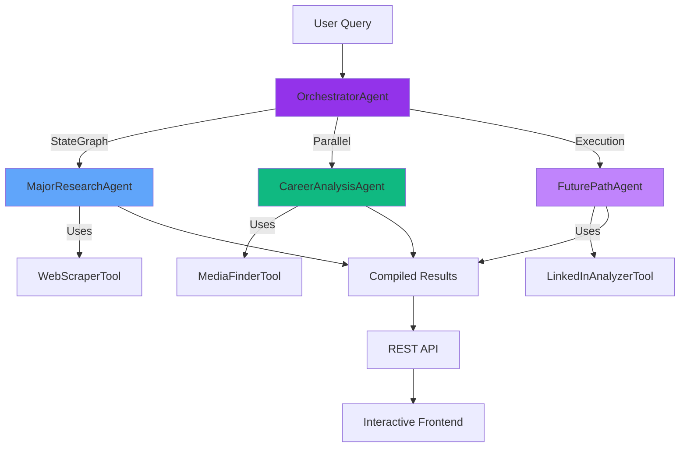

# Orienta - AI Career Path Planner

An intelligent web application that helps users discover their career paths through AI-powered analysis. Built with **SpoonOS** multi-agent framework for parallel reasoning and coordination.


## 🎯 Features

- **AI-Powered Career Analysis**: Multi-agent system analyzes user interests and recommends personalized career paths
- **Interactive Bubble Visualization**: Three-layer bubble interface showing Majors → Careers → Future Paths
- **Real-time Insights**: Statistical analysis of career progression using LinkedIn-style data
- **Rich Details**: Comprehensive information including salaries, benefits, professional resources, and progression statistics
- **Beautiful UI**: Modern dark theme with vibrant gradients, glassmorphism, and smooth animations

## 🏗️ Architecture

This application demonstrates **interoperable AI systems that talk, reason, and collaborate** using SpoonOS framework.

### Multi-Agent System



### Agent Responsibilities

1. **MajorResearchAgent** 🎓
   - Analyzes user interests and skills
   - Recommends 3-5 relevant university majors
   - Scrapes university websites for major details
   - Provides structured major information

2. **CareerAnalysisAgent** 💼
   - Identifies career paths for each major
   - Researches salary, benefits, work intensity
   - Finds professional resources (YouTube, blogs, interviews)
   - Analyzes job market outlook

3. **FuturePathAgent** 📈
   - Projects career progression over 5-10 years
   - Calculates promotion/transition statistics
   - Identifies common progression paths
   - Generates data-driven insights

4. **OrchestratorAgent** 🎯
   - Coordinates multi-agent workflow using StateGraph
   - Manages parallel execution
   - Handles error recovery
   - Compiles final results

## 🚀 Installation

### Prerequisites

- Python 3.12 or higher
- Node.js (optional, for development tools)
- API key for at least one LLM provider (DeepSeek or Gemini)

### Step 1: Clone and Setup Python Environment

```bash
cd d:/Hackathon25_2

# Create virtual environment
python -m venv venv

# Activate virtual environment
# Windows PowerShell:
.\venv\Scripts\Activate.ps1

# Install dependencies
pip install -r requirements.txt
```

### Step 2: Configure API Keys

1. Copy the example environment file:
   ```bash
   copy .env.example .env
   ```

2. Edit `.env` and add your API keys:
   ```env
   DEEPSEEK_API_KEY=your_actual_api_key_here
   LLM_PROVIDER=deepseek
   MODEL_NAME=deepseek-chat
   ```

### Step 3: Start the Backend Server

```bash
cd backend
python api/server.py
```

The API server will start on `http://localhost:5000`

### Step 4: Open the Frontend

Simply open `frontend/index.html` in a modern web browser (Chrome, Firefox, Edge).

## 📖 Usage

1. **Enter Your Interests**: Describe your passions, skills, and career goals in the text area
2. **Analyze**: Click "Analyze My Path" to start the AI analysis
3. **Explore Majors**: View recommended majors as vibrant blue bubbles
4. **Click to Dive Deeper**: 
   - Click a major → see career opportunities (green bubbles)
   - Click a career → see future progression paths (purple bubbles)
5. **View Details**: Click any bubble to see comprehensive information in a modal

## 🧠 Technical Highlights

### SpoonOS Integration

This project showcases SpoonOS's powerful features:

- **StateGraph**: Declarative workflow orchestration with parallel execution
- **ToolCallAgent**: Custom agents with specialized tools
- **Custom Tools**: BaseTool implementations for web scraping and data analysis
- **Graph-based Coordination**: Intelligent routing and state management

### Innovation Points

✅ **Multi-Agent Collaboration**: 4 specialized agents working in coordinated workflow  
✅ **Parallel Reasoning**: Simultaneous analysis of multiple career paths  
✅ **Rich Tool Ecosystem**: Custom tools for diverse data sources  
✅ **Real-world Application**: Practical career planning use case  
✅ **Excellent UX**: Intuitive bubble interface with smooth animations

## 🎨 Design Philosophy

- **Vibrant & Modern**: Rich color gradients and smooth animations
- **Dark Mode First**: Elegant dark theme with glassmorphism
- **User-Centric**: Clear navigation and intuitive interactions
- **Accessible**: Responsive design works on all devices

## 🔧 API Endpoints

- `POST /api/analyze` - Analyze user interests and return career paths
- `GET /api/health` - Health check endpoint
- `GET /api/detail/major/<id>` - Get major details
- `GET /api/detail/career/<id>` - Get career details
- `GET /api/detail/future/<id>` - Get future path details

## 🤝 Contributing

This is a hackathon project demonstrating SpoonOS capabilities. Feel free to explore and extend!

## 📄 License

MIT License - Feel free to use and modify

## 🙏 Acknowledgments

- Built with [SpoonOS](https://xspoonai.github.io/) framework
- Inspired by the need for intelligent career guidance
- Created for SCOOP AI Hackathon 2025

---

**Built with ❤️ using SpoonOS Multi-Agent Framework**


